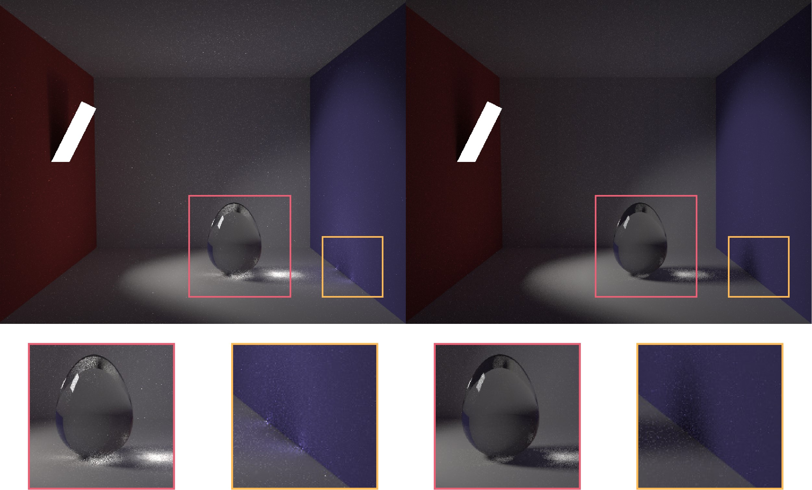
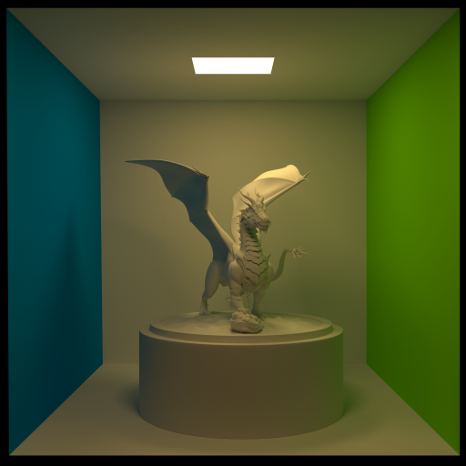
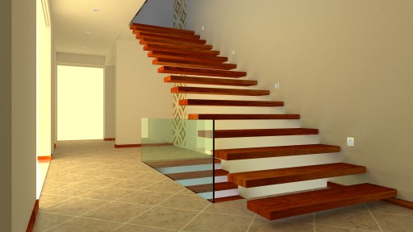
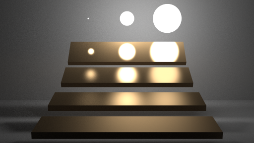
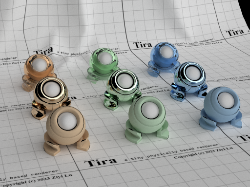
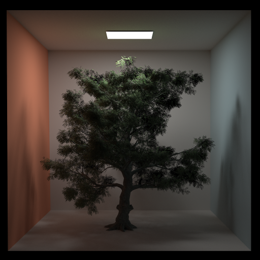
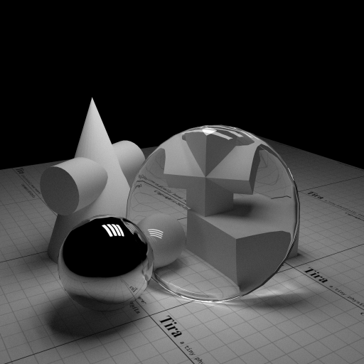
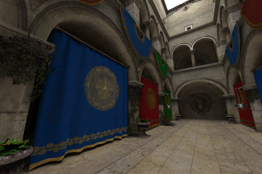

# Monte Carlo Path Tracer

<div style="text-align: center;">Ziyi Lu</div>

<!--
to compile by pandoc:
pandoc Document.md -o Document.pdf -f markdown+implicit_figures+link_attributes
-->

Course Project of *Advanced Computer Graphics——Realistic Image Synthesis Winter Semester 2022* [\[Course Page\]](http://10.76.1.181/courses/graphics/2022/)

1. [Abstract](Document.md#1-abstract)
2. [Theory](Document.md#2-theory)
3. [Implementation](Document.md#3-implementation)
4. [Results](Document.md#4-result)

## 1 Abstract

This project (**Tira**, short for Tiny ray tracer) is a tiny physically based renderer that features **Monte Carlo Path Tracer**. The core functionalities of this project include basic ray tracing utilities, acceleration structures, material apperances, integrators. Both CPU multi-thread and GPU (OpenGL compute shader) versions are implemented.

## 2 Theory

### 2.1 Monte Carlo Path Tracing

The process of rendering can be described as solving the following **rendering equation**:

$$
L_o(p, \omega_o) = \int_{\mathcal{S}^2}f(p, \omega_o, \omega_i)L_i(p, \omega_i)|\cos\theta_i|d\omega_i
$$

The equation can be approximated by **Monte-Carlo integration**:

$$
L_o(p, \omega_o) \approx \frac{1}{N}\sum_{j=1}^N \frac{f(p,\omega_o,\omega_j)L_i(p,\omega_j)|\cos\theta_j|} {p(\omega_j)}
$$

Where $p(\omega_j)$ is the **Probability Distribution Function** (PDF), which describes the distribution of irradiance.

Therefore, the process of Monte-Carlo Path Tracing can be described by the following pseudo code:

```
Li(p, wo):
    Sample a wi from a distribution
    Intersect the ray(p, wi) with the scene at q
    Return 0 if hit nothing
    If the ray hit a light:
        Return Li * brdf * cosine / pdf(wi)
    Else:
        Return Li(q, -wi) * brdf * cosine / pdf(wi)
```

By evaluating Monte-Carlo estimator, we are able to converge the final result nonbiasly by sampling a large number of paths each pixel.

### 2.2 Multiple Importance Sampling

To reduce variance, it is a common strategy to take samples from several distributions since they are extremely hard to be described in just one distribution. Multiple importance sampling (MIS) is the certain strategy to construct a robust Monte-Carlo estimator with these samples from different distritbutions.

The core idea behind MIS is to weight the contributions by a heuristic based on PDF of the samples. The balanced heuristics is as follow:

$$
\hat{w}_i(x) = \frac{c_ip_i(x)}{\sum_j c_jp_j(x)}
$$

Where $\hat{w}_i$ is the weight for the sample drwan from the i-th distribution, $c_i$ is the sample count of the i-th distribution and $p_i$ is the PDF. Also there are other heuristics such as power heuristics and so on.

The MIS is used in Monte-Carlo path tracing for sampling area light and sampling the BRDF, in bidirectional path tracing for weighting each path.

### 2.3 Bidirectional Path Tracing

Bidirectional path tracing trace rays from both camera and light, generating a number of vertices (intersection) with certain probabilities. The bidirectional method then connect these vertices forming a number of paths that contribute to camera with certain PDF. By MIS, we are able to combine these paths together.

Bidirectional method has advantage in rendering effects like caustics. Also it greatly reduce the computation since the vertices are reused multiple times forming new paths rather than trace a new path.

{width=400px}

{width=400px}

{width=400px}

## 3 Implementation

### 3.1 Math and Geometry

I implemented simple vectors and matrices in column major. I tried SIMD accleration, but have not seen significance in performance improvement. The SIMD option is turned off by default.

In geometry part, I implemented ray-triangle, ray-sphere, ray-AABB intersection. 

### 3.2 Scene

To load the provided scene, I use thirdparty liberaries like `tinyobjloader`, `stb` and `pugixml`.

To correctly load the official scene, the `tinyobjloader` has to be modified in order to load `Tr` as transmittance (with 3 components) correctly.

Also, for convenience, I extended the xml file so as to load additional parameters as follows:

- Extra lightings info (directional light & envmap)
- Integrator settings (spp, max bounce and so on)
- Scene settings (acceleration structure type and so on)
- Extra primitives (sphere)
- Kernel settings (for GPU version)

For more information, please check the README file.

### 3.3 Material

This project mainly uses two material models:

- Phong Model
- Glass Model

**Phong Model** can be described by the following equations:

$$
f(\omega_i, \omega_o) = k_d\frac{1}{\pi} + k_s\frac{n+2}{2\pi}\cos^n\alpha
$$

Where $k_d$ is the diffuse reflectivity (`Kd` in .mtl file), $k_s$ is the specular reflectivity (`Ks` in .mtl file), $n$ is the specular exponent (`Ni` in .mtl file). $\alpha$ is the angle between the perfect reflection direction (`reflect(-wi, n)`) and the outgoing direction $\omega_o$.

For **Glass material**, there is chance for both reflection and refraction determined by fresnel term. Fresnel term decides the ratio of reflection and refraction. The scene will automatically decide whether this material is glass or not.

### 3.4 Acceleration Structure

I implemented two acceleration structures (BVH and Octree) and use BVH by default.

The **BVH** is partitioned by SAH (surface area heuristics). I do SAH search for all three axes. To avoid taking too much time building BVH, it takes fixed steps on each axes so as to reduce the total search time from $O(N\log N)$ to $O(N)$.

The **octree** only out performs the BVH w/o SAH for certain scenes, therefore is turned of by default.

### 3.5 Integrator

The Integrator sturct is an abstraction of the process of integrating the rendering equation to output realistic images. To implement certain path tracing algorithm, override the `get_pixel_color` function and here is its declaration:

```c++
virtual float3 get_pixel_color(
    int x, int y, int sample_id, Scene const& scene) = 0;
```

`x` and `y` are pixel coordinates, `sample_id` is used for random generator seed, and `scene` provided everything needed for integrating the rendering equation.

There are three integrator implementated:

1. Whitted style path tracer (took reference from *pbrt*)
2. Monte Carlo path tracer (unidirectional)
3. Bidirectional path tracer

### 3.6 Lighting

Tira supports three types of lighting:

- Area lighting
- Directional lighting (sun light)
- Envmap lighting

**Area lights** are load together with the scene. Objects with non-zero emission are regarded as area lights. All area lights are hittable and will be processed during the path tracing.

**Directional light** can be added to the scene via XML extension. Only one directional light (sun light) for each scene. The solid angle of directional light is also configurable, larger solid angle makes softer shadow and less noise.

**Envmap light** can also be added by XML extension. Currently support only equirectangular envmaps in exr extension are supported. The envmap will be preprocessed to get a 16x16 lookup table for the probabilities of each region to sample for the region of higher radiance.

{width=400px}

### 3.7 GPU Acceleration

To accelerate the integration part, I implemented a GPU version with **OpenGL compute shader**. The scene and acceleration structure is constructed by CPU and passed to storage buffers. For performance, the GPU version renders in tiles with adaptive samples per kernel invocation.

Theoretically, OpenCL or CUDA are more suitable for such heavy load task and OpenGL is more likely to crash on such task. But I only choose OpenGL for convenience for this tiny renderer, and it does speed up the calculation significantly comparing to any CPU.

## 4 Result

All the images in this document is compressed, **for images in original size and other images, see the supplement material**.

### 4.1 Default scenes

The following session I will demonstrate some images rendered by this renderer. Most of them are rendered with GPU version, which is identical to CPU version given the same size and samples.

For the default scenes provided in the course page, I doubled the image size to get better results.

{width=400px}

{width=400px}

{width=400px}

### 4.2 Other scenes

For my own scenes, I select some of the representative ones that each demonstrates some of the features of my renderer.

{width=400px}

{width=400px}

{width=400px}

{width=400px}

## Reference

[1] Peter Shirley et al., Ray Tracing in One Weekend Series, https://raytracing.github.io/

[2] Matt Pharr et al., Physically Based Rendering: From Theory To Implementation, https://www.pbr-book.org/

[3] Jason Lawrence, Importance Sampling of the Phong Reflectance Model, https://www.cs.princeton.edu/courses/archive/fall16/cos526/papers/importance.pdf

[5] Brian Karis, Specular BRDF Reference, http://graphicrants.blogspot.com/2013/08/specular-brdf-reference.html

[6] Walt Disney Animation Studios, BRDF Explorer, https://github.com/wdas/brdf

[7] Eric Veach, Robust Monte Carlo Methods for Light Transport Simulation, Ph.D. dissertation, Stanford University, December 1997, http://graphics.stanford.edu/papers/veach_thesis/