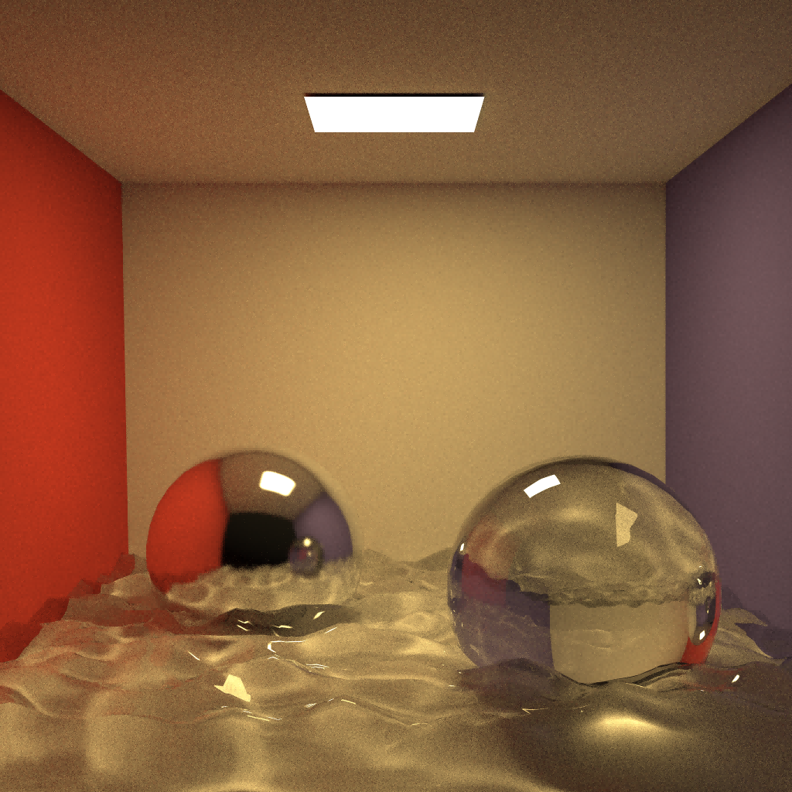

# Tira

A Tiny Physically Based Renderer for ZJU Computer Graphics 2022 Course Project

[Course Page](http://10.76.1.181/courses/graphics/2022/) - only available in ZJU internal network

## Features

- [x] Basic ray tracing utilities (math, geometry, transform)
- [x] BVH/Octree acceleration structures
- [x] Load provided scene (.obj + .xml)
- [x] Other primitives (sphere)
- [x] Standard path tracer
- [ ] Bidirectional path tracer
- [x] Materials (Blinn-Phong BRDF + Disney BRDF + Glass BSDF)
- [x] OpenGL compute shader acceleration

## Compile and Run

### Visual Studio

Open `Tira.sln` with Visual Studio 2022 or other version, the Executable file `Tira.exe` will be output to root directory. Use parameter to render other scene:

```shell
./Tira.exe cornell-box
```

Note: the `{SCENE}.obj` and `{SCENE}.xml` must be placed under `{SCENE}/` folder in `Asset/` folder. Go to `Asset/` folder for an example.

### Cmake

```shell
mkdir Build
cd Build
cmake ..
```

### Makefile

```shell
make
```

## OpenGL

This project also provided an OpenGL compute shader version for acceleration. The OpenGL version highly depend on original Tira project, including scene, acceleration structure, material.

Open `Tira.sln` and set Tira_GPU as startup project, build and run. The build executable file will be output to root directory. Use command line to render other scene:

```shell
./Tira_GPU.exe cornell-box
```

## XML Extension

I extend the original xml file for scene description as follow:

- Add integrator description
- Add scene description
- Add envmap description
- Add sunlight description
- Add sphere description

```xml
<!-- 
  Integrator settings:
    - spp: Samples per Pixel
    - mis: Use MIS in renderer
    - maxbounce: Max bounce or depth in renderer
-->
<integrator spp="256" version="2" mis="true" maxbounce="8" />
<!-- 
  Scene settings:
    - scale: Scale the scene in case the scene is too small or too large
    - accel: Acceleration structure type 'bvh' | 'octree'
-->
<scene scale="1.0" accel="bvh" />
<!-- 
  Envmap settings:
    - url: URL of envmap, envmap must be in equirectangular projection
-->
<envmap url="asset/envmap/indoor.exr" />
<!-- 
  Sunlight settings:
    - direction: Direction toward sun
    - radiance: Sun radiance
    - solidangle: Sun solid angle
-->
<sunlight direction="0.8, 1.0, -0.5" radiance="20, 20, 20" solidangle="0.0687" />
<!-- 
  Sphere primitive (Currently only available in CPU version):
    - mtlname: Material name as in .mtl file
    - center: Sphere center position (in world coordinates)
    - radius: Sphere radius (in world coordinates)
-->
<sphere mtlname="material_0" center="0.0, 1.0, 1.0" radius="0.1" />
<!-- 
  Render tiling settings (Currently only available in GPU version):
    - size: Tile size
    - involk: Tiles per frame
    - spf: Samples per frame for currently rendering tiles
-->
<tile size="64" num="16" spf="8" />
```

## Thirdparty Liberaries

- stb https://github.com/nothings/stb
  - read & write image
- tinyexr https://github.com/syoyo/tinyexr
  - read exr image
- tinyobjloader https://github.com/tinyobjloader/tinyobjloader
  - read obj file
  - Note: modified in line 2210 for this project:
  ```c++
  if (token[0] == 'T' && token[1] == 'r' && IS_SPACE(token[2])) {
      token += 2;

      // Interpret Tr as transmittance for this project.
      real_t r, g, b;
      parseReal3(&r, &g, &b, &token);
      material.transmittance[0] = r;
      material.transmittance[1] = g;
      material.transmittance[2] = b;

      // ...
      continue;
  }
  ```
- pugixml https://github.com/zeux/pugixml
  - read xml file
- Poisson Disk Points Generator https://github.com/corporateshark/poisson-disk-generator
  - generate poisson disk

## Rendered Images


> staircase, rendered in 512 SPP, 2560x1440, by RTX 2070s in 24 mins



> cornellbox, rendered in 512 SPP, 2048x2048, by RTX 2070s in 29 mins


> sponza, rendered in 64 SPP, 2400x1600, by RTX 2070s in 23 mins (lit by sunlight)

## Reference

[1] Peter Shirley et al., Ray Tracing in One Weekend Series, https://raytracing.github.io/

[2] Matt Pharr et al., Physically Based Rendering: From Theory To Implementation, https://www.pbr-book.org/

[3] Jason Lawrence, Importance Sampling of the Phong Reflectance Model, https://www.cs.princeton.edu/courses/archive/fall16/cos526/papers/importance.pdf

[5] Brian Karis, Specular BRDF Reference, http://graphicrants.blogspot.com/2013/08/specular-brdf-reference.html

[6] Walt Disney Animation Studios, BRDF Explorer, https://github.com/wdas/brdf

[7] Eric Veach, Robust Monte Carlo Methods for Light Transport Simulation, Ph.D. dissertation, Stanford University, December 1997, http://graphics.stanford.edu/papers/veach_thesis/