# Tira

A Tiny Physically Based Renderer for ZJU Computer Graphics 2022 Course Project to do Path Tracing with CPU & GPU (GLSL Compute Shader)

[Course Page](http://10.76.1.181/courses/graphics/2022/) - only available in ZJU internal network

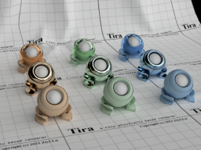

## Gallery

| Model                                                                         | Rendered Image                              | Description                                                   |
|-------------------------------------------------------------------------------|---------------------------------------------|---------------------------------------------------------------|
| cornell-box (course)                                                          | 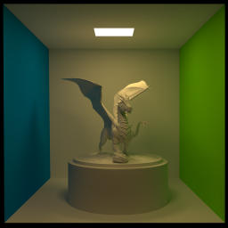           | 4096 SPP, 2048x2048, by RTX 2070s in 41 mins.                 |
| staircase (course)                                                            | 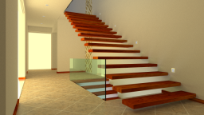              | 512 SPP, 2560x1440, by RTX 2070s in 24 mins.                  |
| veach-mis (course)                                                            | 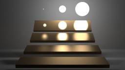             | 8192 SPP, 2560x1440, by RTX 2070s in 3 hours 20 mins.         |
| [CornellBox-Original](https://casual-effects.com/g3d/data10/index.html#mesh5) | 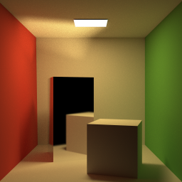  | 16384 SPP, 2048x2048, by RTX 2070s in 34 mins.                |
| [CornellBox-Water](https://casual-effects.com/g3d/data10/index.html#mesh5)    |        | 512 SPP, 2048x2048, by RTX 2070s in 29 mins.                  |
| [CornellBox-Sphere](https://casual-effects.com/g3d/data10/index.html#mesh5)   | 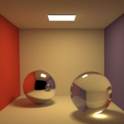      | 512 SPP, 1024x1024, by RTX 2070s.                             |
| [CornellBox-Oak](https://casual-effects.com/g3d/data10/index.html#mesh37)     | 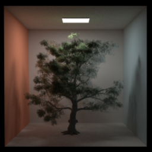          | 64 SPP, 1024x1024, by RTX 2070s in 5 mins 24 secs.            |
| [sponza](https://casual-effects.com/g3d/data10/index.html#mesh10)             | 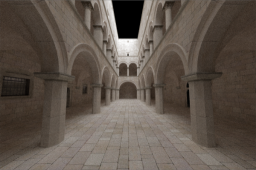                  | 64 SPP, 2400x1600, by RTX 2070s in 23 mins (lit by sunlight). |
| [fireplace_room](https://casual-effects.com/g3d/data10/index.html#mesh13)     | 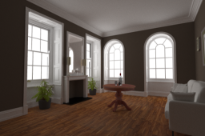         | 512 SPP, 2400x1600, by RTX 2070s in 4 hours.                  |
| [teapot](https://casual-effects.com/g3d/data10/index.html#mesh35)             | 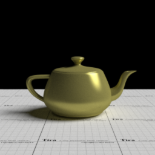                | 2048 SPP, 1024x1024, by RTX 2070s in 9 mins (lit by sunlight).|
| [teapot](https://casual-effects.com/g3d/data10/index.html#mesh35)             | 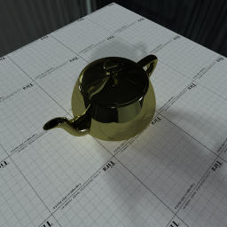                | 4096 SPP, 2048x2048, by RTX 2070s in 48 mins (lit by envmap). |
| geometry sets (created by blender)                                            |                   | 2048 SPP, 2048x2048, by GTX 960 in 36 mins.                   |

## Features

- [x] Basic ray tracing utilities (math, geometry, transform) from scratch
- [x] BVH/Octree acceleration structures
- [x] Load provided scene (.obj + .xml)
- [x] Primitives (sphere)
- [x] Directional light & Environment map support
- [x] Whitted style ray tracer
- [x] Monte Carlo path tracer
- [ ] Bidirectional path tracer (under construction)
- [x] Materials (Blinn-Phong BRDF + Disney BRDF + Glass BSDF)
- [x] GPU acceleration (OpenGL compute shader)

## Compile and Run

### Visual Studio

Open `Tira.sln` with Visual Studio 2022 (or other version, need to retarget the project), select `Tira_CPU` or `Tira_GPU` as startup project and build. The Executable file `Tira_CPU.exe` and `Tira_GPU.exe` will be output to root directory. Use parameter to render other scene:

```shell
./Tira_CPU.exe cornell-box
./Tira_GPU.exe cornell-box
```

Note: the `{SCENE}.obj` and `{SCENE}.xml` must be placed under `Asset/{SCENE}/` folder. Go to `Asset/CornellBox-Original` folder for an example.

**Note** Compile this project in release mode for performance

### Cmake

```shell
mkdir Build
cd Build
cmake ..
make
```

## GPU Version

This project also provided an GPU version for path trace acceleration. The GPU version is dependent on the CPU version for acceleration sturcture construction.

To compile the GPU version, open `Tira.sln` in Visual Studio 2022 (or other version) and set `Tira_GPU` as startup project and build. The executable file `Tira_GPU.exe` will be output to the root directory. Use command line as follow:

```shell
Tira_GPU.exe cornell-box
```

## XML Extension

I extend the original xml file for the following additional info:

```xml
<!-- 
  Integrator settings:
    - spp: Samples per Pixel
    - mis: Use MIS in renderer
    - maxbounce: Max bounce or depth in renderer
    - robustlight: Enable light to be hit with larger tollerance
-->
<integrator spp="256" mis="true" maxbounce="8" robustlight="true" />
<!-- 
  Scene settings:
    - scale: Scale the scene in case the scene is too small or too large
    - accel: Acceleration structure type 'bvh' | 'octree'
-->
<scene scale="1.0" accel="bvh" />
<!-- 
  Envmap settings:
    - url: URL of envmap, envmap must be in equirectangular projection
    - scale: Scale of envmap intensity
-->
<envmap url="asset/envmap/indoor.exr" scale="1.0" />
<!-- 
  Sunlight settings:
    - direction: Direction toward sun
    - radiance: Sun radiance
    - solidangle: Sun solid angle
-->
<sunlight direction="0.8, 1.0, -0.5" radiance="20, 20, 20" solidangle="0.0687" />
<!-- 
  Sphere primitive (Currently only available in CPU version):
    - mtlname: Material name as in .mtl file
    - center: Sphere center position (in world coordinates)
    - radius: Sphere radius (in world coordinates)
-->
<sphere mtlname="material_0" center="0.0, 1.0, 1.0" radius="0.1" />
<!-- 
  GPU compute shader kernel settings:
    - size: Tile size
    - macro: Shader additional macros
-->
<kernel size="64" macro="" />
```

## Thirdparty Liberaries

- stb https://github.com/nothings/stb
  - read & write image
- tinyexr https://github.com/syoyo/tinyexr
  - read exr image
- tinyobjloader https://github.com/tinyobjloader/tinyobjloader
  - read obj file
  - Note: modified in line 2210 for this project:
  ```c++
  if (token[0] == 'T' && token[1] == 'r' && IS_SPACE(token[2])) {
      token += 2;

      // Interpret Tr as transmittance for this project.
      real_t r, g, b;
      parseReal3(&r, &g, &b, &token);
      material.transmittance[0] = r;
      material.transmittance[1] = g;
      material.transmittance[2] = b;

      // ...
      continue;
  }
  ```
- pugixml https://github.com/zeux/pugixml
  - read xml file
- Poisson Disk Points Generator https://github.com/corporateshark/poisson-disk-generator
  - generate poisson disk

## Reference

[1] Peter Shirley et al., Ray Tracing in One Weekend Series, https://raytracing.github.io/

[2] Matt Pharr et al., Physically Based Rendering: From Theory To Implementation, https://www.pbr-book.org/

[3] Jason Lawrence, Importance Sampling of the Phong Reflectance Model, https://www.cs.princeton.edu/courses/archive/fall16/cos526/papers/importance.pdf

[5] Brian Karis, Specular BRDF Reference, http://graphicrants.blogspot.com/2013/08/specular-brdf-reference.html

[6] Walt Disney Animation Studios, BRDF Explorer, https://github.com/wdas/brdf

[7] Eric Veach, Robust Monte Carlo Methods for Light Transport Simulation, Ph.D. dissertation, Stanford University, December 1997, http://graphics.stanford.edu/papers/veach_thesis/